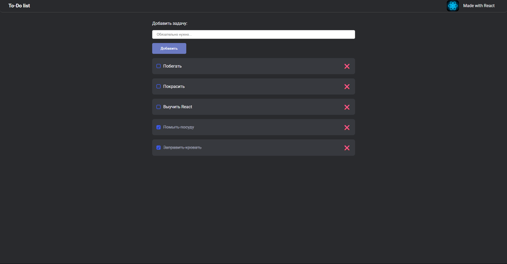

# To-Do List на React

Простое и удобное приложение для управления задачами с автоматическим сохранением в браузере. Позволяет сосредоточиться на важном!

## Особенности

- 📝 Добавление новых задач
- ✅ Отметка выполненных заданий
- ❌ Удаление ненужных задач
- 💾 Автосохранение в localStorage
- 🔄 Сортировка: активные задачи сверху
- 🎨 Приятный современный интерфейс

## Технологии

  
  
  

## Быстрый старт

### Установка и запуск

1. Клонируйте репозиторий:
   git clone [https://github.com/ваш-username/react-todo-list.git](https://github.com/AlexeyNizovtsev/react-todo-list.git)
2. Перейдите в папку проекта:
   cd react-todo-list

3. Установите зависимости:
   npm install

4. Запустите приложение:
   npm run dev

5. Откройте в браузере:
   http://localhost:5173

## Как пользоваться

1. Введите задачу в поле ввода
2. Нажмите "Добавить" или клавишу Enter
3. Отмечайте выполненные задачи кликом по чекбоксу
4. Удаляйте задачи кнопкой ❌
5. Все изменения сохраняются автоматически
